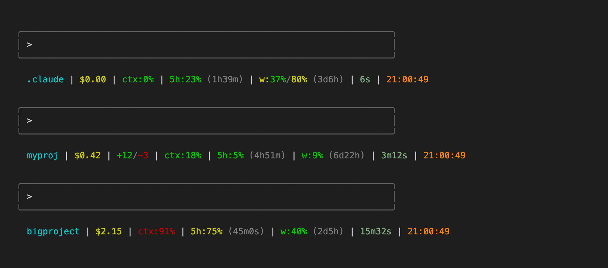

**English** | [Русский](README.ru.md)

# claude-code-statusline

[](https://github.com/kskadart/claude-code-statusline/actions/workflows/ci.yml)

A status line for [Claude Code](https://claude.com/claude-code). It runs on
every render, below the chat, and shows the project folder, the current
model name, session cost, and context window usage. It also shows how much
of your 5-hour and 7-day rate limit you've used, when each one resets, how
long the session has run, and the clock. You install it as a single script
plus one line in `settings.json`.



## Example

```
.claude | $0.00 | ctx:0% | 5h:23% (1h39m) | w:37% (3d6h) | Fable 5.1 80% (2d21h) | 6s | 12:30:13
```

The `+add/-del` segment appears only when the session has added or removed
lines:

```
myproj | $0.42 | +12/-3 | ctx:18% | 5h:5% (4h51m) | w:9% (6d22h) | Sonnet 5 | 3m12s | 09:04:21
```

## What each segment means

| Segment | Source (stdin JSON field) | Meaning | Color thresholds |
|---|---|---|---|
| dir | `workspace.current_dir` | Last path component; `~` if it equals `$HOME` | cyan, no thresholds |
| cost | `cost.total_cost_usd` | Session cost so far, `$X.XX` | yellow, no thresholds |
| `+add/-del` | `cost.total_lines_added` / `total_lines_removed` | Lines changed this session; hidden when both are 0 | green `+`, red `-` |
| ctx | `context_window.used_percentage` | Context window fill | green <70, yellow 70-89, red ≥90 |
| 5h | `rate_limits.five_hour.used_percentage`, `resets_at` | 5-hour rate limit usage and time to reset (`XdYh` / `XhYm` / `XmYs` / `Xs` / `now`) | green <70, yellow 70-89, red ≥90 |
| w | `rate_limits.seven_day.used_percentage`, `resets_at` | Weekly (7-day) rate limit usage and time to reset | green <70, yellow 70-89, red ≥90 |
| model | `model.display_name` (falls back to `model.id`); percent/reset from the usage endpoint's `limits[]` | Current Claude model name, plus that model's own weekly usage and time to reset in parentheses; hidden entirely when both name fields are absent or empty; the percent/reset part is hidden when the model-limit fetch is disabled, fails, has no cache yet, or has no matching row for this model | name magenta, no thresholds; percent green <70, yellow 70-89, red ≥90 |
| duration | `cost.total_duration_ms` | Session wall-clock duration | sage, no thresholds |
| clock | local `date` | Current local time | orange, no thresholds |

## Requirements

- bash, jq
- curl — needed for the rate-limit fallback and for the per-model weekly
  usage (both macOS-only, see below)
- Claude Code with `statusLine` support
- for development: perl, shellcheck, bats

The main path (data from stdin) works on macOS and Linux. Both the
rate-limit fallback and the per-model weekly usage (see below) are
macOS-only — they use the Keychain (`security`) and BSD `date -j -f`; on
Linux both are silently skipped (the per-model fetch is skipped without
even trying, since `security` isn't on PATH there).

## Install

1. Copy `statusline.sh` to `~/.claude/statusline.sh` and `chmod +x` it.
2. Add to `~/.claude/settings.json`:

```json
{
  "statusLine": { "type": "command", "command": "~/.claude/statusline.sh", "padding": 2 }
}
```

## Configuration

- `CLAUDE_STATUSLINE_CACHE_DIR` — where the fallback rate-limit cache is
  written. Default: `~/.claude/cache`.
- `CLAUDE_STATUSLINE_MODEL_LIMIT` — set to `0` to disable the per-model
  weekly-usage fetch described below and show only the model name. Default:
  enabled.

## How rate limits are obtained

1. First choice: the `rate_limits` field in the JSON Claude Code pipes to
   the script on stdin. Current Claude Code versions populate this, and
   that's all the script needs for the `5h` and `w` segments.
2. Fallback, only if that field is missing: the script reads the OAuth
   token that Claude Code itself stores in the macOS Keychain (item
   `Claude Code-credentials`) and queries
   `https://api.anthropic.com/api/oauth/usage` with the header
   `anthropic-beta: oauth-2025-04-20`. The response is cached for 60s in a
   file with mode `600`; the request has a 2s timeout.

   **This fallback endpoint is unofficial and undocumented.** It can change
   or disappear without notice. The token is sent only to
   `api.anthropic.com`, nowhere else. If this isn't acceptable for you,
   delete the fallback block from the script — the stdin path keeps
   working on its own.

3. The model segment's own weekly usage (the `NN% (reset)` shown right
   after the model name) is not part of stdin at all — Claude Code's
   `rate_limits` field has no per-model breakdown. Whenever a model name is
   known, the script fetches this from the same
   `https://api.anthropic.com/api/oauth/usage` response's `limits[]` array
   (same OAuth token, same 60s cache, same unofficial-endpoint caveat as
   above), at most once per render, and picks the entry that scopes to the
   current model. The matching rule: the first `limits[]` entry with
   `kind == "weekly_scoped"` whose `scope.model.display_name` matches the
   current model case-insensitively (the stdin `model.display_name` starts
   with it; if there is no display name, `model.id` contains it). Set
   `CLAUDE_STATUSLINE_MODEL_LIMIT=0` to disable this fetch and show only
   the model name, as before this feature existed.

   curl honors `HTTPS_PROXY`/`CURL_CA_BUNDLE`; behind a TLS-intercepting
   proxy, give curl the proxy's CA via `CURL_CA_BUNDLE`, otherwise the
   fetch fails silently and only the model name is shown.

## Design notes

- The script runs on the hot path — once per render. Keep forks minimal;
  no `git` calls (branch info is intentionally not shown).
- If you change the segment layout, update the comment at the top of
  `statusline.sh` to match.
- The script's own working directory is not the session's working
  directory — the folder shown always comes from `workspace.current_dir`.

## Development

```bash
shellcheck statusline.sh docs/render-screenshot.sh tests/stubs/*
bats tests/
```

Install the tools:

```bash
# macOS
brew install shellcheck bats-core

# Debian/Ubuntu
sudo apt-get install -y shellcheck bats
```

Tests never touch the real Keychain or network: `tests/stubs/security` and
`tests/stubs/curl` are fakes prepended to `PATH`, and `HOME` /
`CLAUDE_STATUSLINE_CACHE_DIR` point at per-test temp directories. See
`tests/statusline.bats` and `tests/fixtures/`.

To regenerate `docs/screenshot.png`, run `docs/render-screenshot.sh --render`
(the `--render` flag is required to produce the PNG; without it the script
only writes `docs/screenshot.html`). Rendering needs a local Chrome or
Chromium binary — set `CHROME_BIN` if it isn't auto-detected.

## License

MIT, see [LICENSE](LICENSE).
